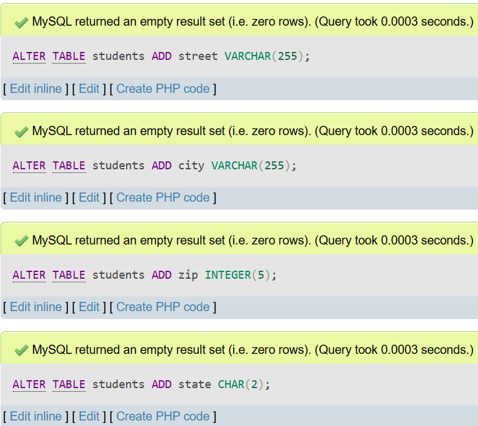
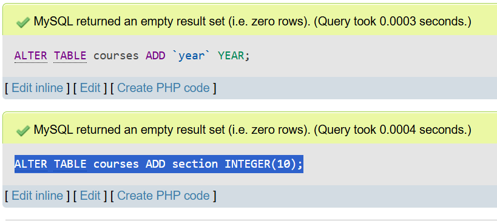
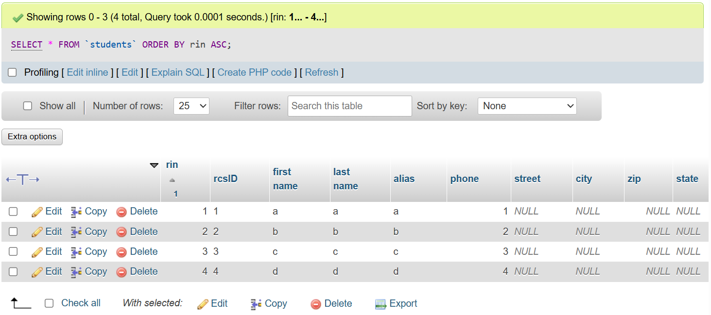
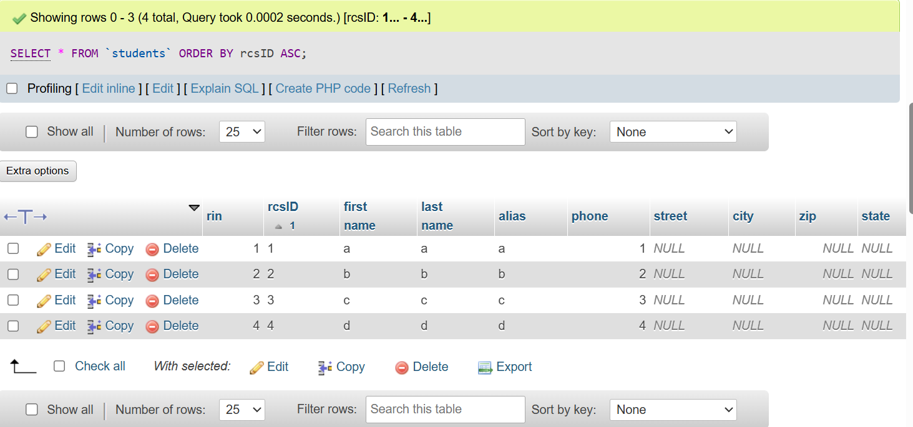
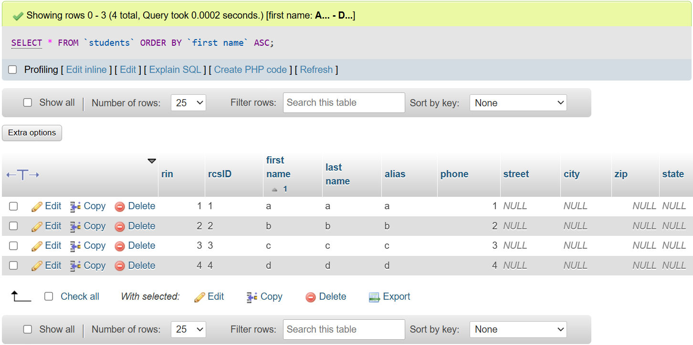
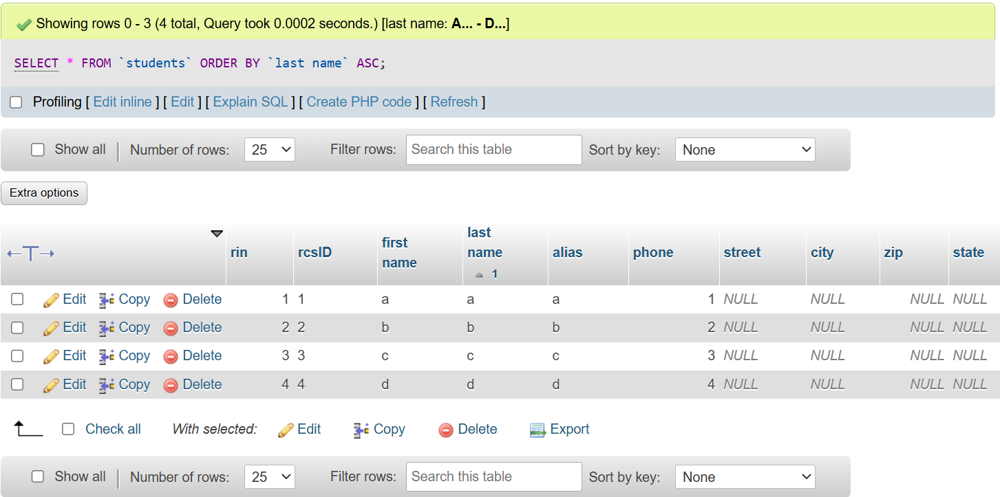
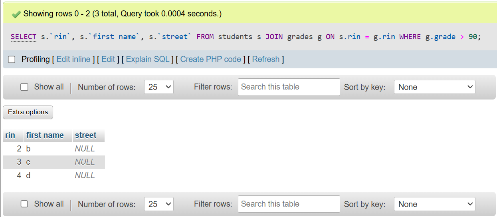
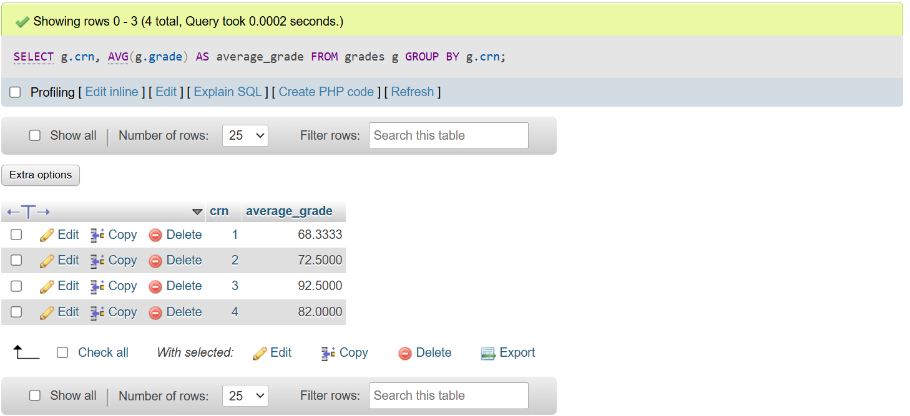

# SQL Commands for Part 2

## Adding location data to students table
ALTER TABLE students ADD street VARCHAR(255);
ALTER TABLE students ADD city VARCHAR(255);
ALTER TABLE students ADD zip INTEGER(5);
ALTER TABLE students ADD state CHAR(2);
### SQL Output

## Adding section/year to courses table
ALTER TABLE courses ADD `year` YEAR;
ALTER TABLE courses ADD section INTEGER(10);
### SQL Output

## Creating grades table
CREATE TABLE grades (
    id INTEGER PRIMARY KEY AUTO_INCREMENT,
    crn INTEGER NOT NULL,
    rin INTEGER NOT NULL,
    grade INTEGER(3) NOT NULL,
    FOREIGN KEY (crn) REFERENCES courses(crn),
    FOREIGN KEY (rin) REFERENCES students(rin)
);
### SQL Output

## Inserting courses
INSERT INTO `courses`(`crn`, `prefix`, `number`, `title`)
VALUES (1,"AAAA", 1234, 'silly');

INSERT INTO `courses`(`crn`, `prefix`, `number`, `title`)
VALUES (2,"BBBB", 2345, 'billy');

INSERT INTO `courses`(`crn`, `prefix`, `number`, `title`)
VALUES (3,"CCCC", 3456, 'willy');

INSERT INTO `courses`(`crn`, `prefix`, `number`, `title`)
VALUES (4,"DDDD", 4567, 'dilly');
### SQL Output

## Inserting students
INSERT INTO `students`(`rin`, `rcsID`, `first name`, `last name`, `alias`, `phone`)
VALUES (1,1,'a','a','a',1);

INSERT INTO `students`(`rin`, `rcsID`, `first name`, `last name`, `alias`, `phone`)
VALUES (2,2,'b','b','b',2);

INSERT INTO `students`(`rin`, `rcsID`, `first name`, `last name`, `alias`, `phone`)
VALUES (3,3,'c','c','c',3);

INSERT INTO `students`(`rin`, `rcsID`, `first name`, `last name`, `alias`, `phone`)
VALUES (4,4,'d','d','d',4);
### SQL Output

## Inserting Grades
INSERT INTO `grades`(`crn`, `rin`, `grade`)
VALUES (1, 1, 50);

INSERT INTO `grades`(`crn`, `rin`, `grade`)
VALUES (1, 2, 60);

INSERT INTO `grades`(`crn`, `rin`, `grade`)
VALUES (1, 3, 95);

INSERT INTO `grades`(`crn`, `rin`, `grade`)
VALUES (2, 1, 60);

INSERT INTO `grades`(`crn`, `rin`, `grade`)
VALUES (2, 2, 85);

INSERT INTO `grades`(`crn`, `rin`, `grade`)
VALUES (3, 1, 90);

INSERT INTO `grades`(`crn`, `rin`, `grade`)
VALUES (3, 2, 95);

INSERT INTO `grades`(`crn`, `rin`, `grade`)
VALUES (4, 2, 60);

INSERT INTO `grades`(`crn`, `rin`, `grade`)
VALUES (4, 3, 88);

INSERT INTO `grades`(`crn`, `rin`, `grade`)
VALUES (4, 4, 98);
### SQL Output

## List students in order on col
SELECT * FROM `students` ORDER BY rin ASC;
SELECT * FROM `students` ORDER BY rcsID ASC;
SELECT * FROM `students` ORDER BY `first name` ASC;
SELECT * FROM `students` ORDER BY `last name` ASC;
### SQL Output (cmd i = img i)

## List students if grade > 90
SELECT s.`rin`, s.`first name`, s.`street`
FROM students s
JOIN grades g ON s.rin = g.rin
WHERE g.grade > 90;
### Results in students7.png

## Compute Course Averages
SELECT g.crn, AVG(g.grade) AS average_grade
FROM grades g
GROUP BY g.crn;
### SQL Output

## Compute Course Numbers
SELECT g.crn, COUNT(DISTINCT g.rin) AS student_count
FROM grades g
GROUP BY g.crn;
### SQL Output
